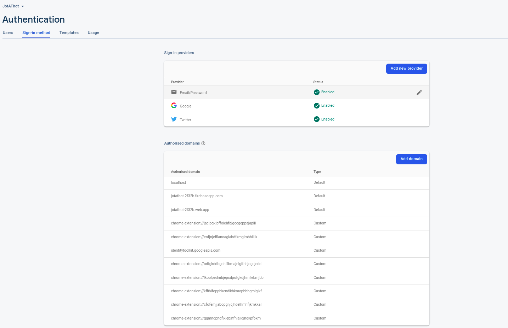

# How to run the app as a chrome extension in developer mode
- after cloning move to the root directory
- run the command ```npm install``` to install all the node packages
- move to the webpage directory and run the command ```npm install``` to install all the node packages.
- now in the webpage directory , run ```npm run start``` , this starts the frontend server for hosting the webpage that enables us to authorise the email auth token link sent by firebase when authenticating/signing in through email mode.
- in the root directory, create the build by ```npm run build``` command
- move to chrome://extensions and turn on the developer mode
- Choose load unpacked extension and load the build folder in the root directory
- Now you have loaded the unpacked extension
- 
- you also need to copy the extension id and replace it with "extensionId variable in src/ccomponents/templates/login.js" and also need to unblock the extension domain in the authorised domain section in firebase by adding it in this pattern: ```chrome-extension://<extension_id>``` (this is required as firebase first checks if the requests are coming from an authorised domain or not), the above image can help you in adding this.
- Now again create the latest build (as we changed the extensionId), by ```npm run build``` in the root directory.


- Now you are good to go as the app is up and running locally.

# Understanding the existing Codebase (as of 2 July 2022)
- We have following components full done by Frontend Team and approved by @shrix
1. Login page frontend done (refer login.js in /src/components/templates)
2. Login page firebase auth working (refer AuthContext.js in /src/components/contexts)
3. Jot Bar Frontend done (refer frame.js, main.js, jot.js in src/components/templates) 
4. Find Bar Frontend done (refer frame.js, main.js, find.js in src/components/templates)
5. History Frontend done except more button placement to end of the 2nd line for all jots (refer main.js, history.js in src/components/templates)
6. Settings page Frontend done except hotkeys not written as they aren't implemented (refer settings.js in src/components/templates)
7. Linking in settings.js working except when linking email auth (currently working on that) (refer AuthContext.js in /src/components/contexts , settings.js in src/components/templates)
8. background.js in /public directory which listens to the auth token sent by the webpage and also fetches the screen width for resizing the extension according to the browser screen width using a simple if-else logic.
9. /webpage folder which handles the auth link sent when logging in through email mode.
10. Manifest.json in /public which is the most important file as extension gets loaded through this into the browser.
11. /src/icons folder gives has important and useful icons, other icons are imported from mui


# Structure of the code
- the absolute parent file is App.js in /src but we haven't touched it. 
- the parent file for our whole frontend is frame.js in src/components/templates
- it imports all the individual components in most of the frontend
- there are some imports inside main.js too


# Integrating backend , APIs
- Anyone having a basic knowledge of how frontend backend works can integrate the APIs.
- with extensions, the case is a little bit different and after sending a request to the api, you need to listen to the response in the background.js in /public directory
- then you can either store the response locally (local storage) or send it to the concerned file.

# Note:
1. all files have /*global chrome*/ comment as this helps extension/chrome APIs to understand the keyword "chrome".
2. searchhistory earlier had fuzzy search but as @shrix wanted the search to be a get request from backend, the file has been commented right noe, its frontend can be taken from history.js or can worked upon after uncommenting
